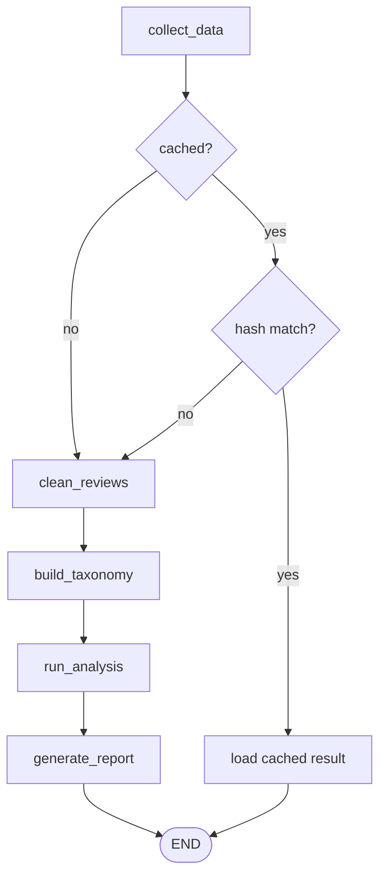
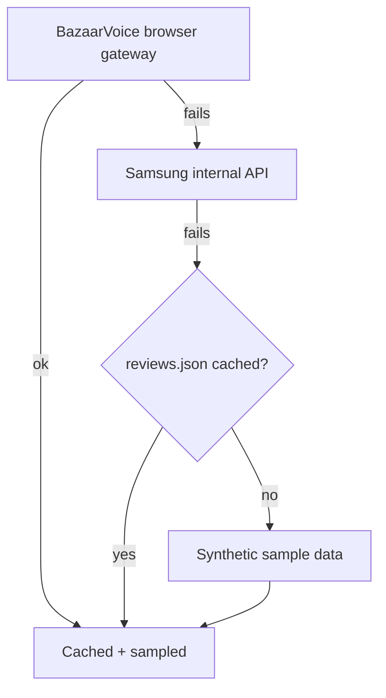
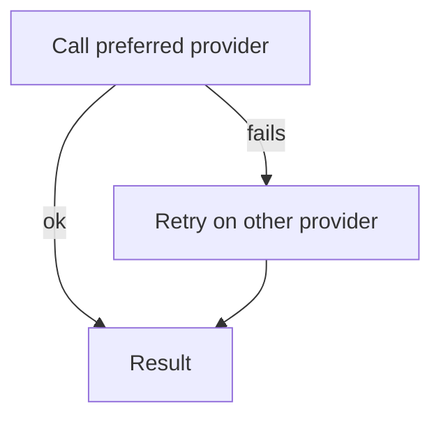

# Samsung TV VOC Intelligence Platform

AI-powered Voice of Customer (VOC) analysis for Samsung TVs. Scrapes reviews, cleans and classifies them, runs LLM analysis agents, and produces a Markdown/JSON report. Accessible via CLI, REST API, or a Next.js dashboard.

**Primary users:** in-house marketers (PDP copy, ad messaging), CX/support (FAQ updates, response scripts) — designed to extend to product/PM and sales enablement.

Every analysis is grounded in both the review text **and** the product spec/PDP (price, account requirements, delivery status), so a genuine **product issue** can be separated from a **purchase-experience issue** (delivery, setup, installation).

## Architecture



- `cached?` only checked if `--skip-if-cached` was passed
- `hash match?` compares a hash of reviews + model_code + max_reviews + spec against the last saved manifest
- `run_analysis` runs the 11 agents below
- `generate_report` writes Markdown + JSON, then the manifest for next run's cache check

### Data collection



- Only the **browser gateway** (Playwright-driven, since plain HTTP gets a 401) is confirmed working — it fetches the entire population in one run (~2,800 reviews)
- Samsung's internal API fallback is best-effort and unverified
- Whichever stage produces the final list gets cached to `data/raw/{model_code}/reviews.json` — including synthetic data, if every live source fails with no prior cache
- A sample (`--max-reviews`, default 200) is drawn for LLM analysis, stratified by rating so its sentiment mix matches the full population

**Product spec** is a merge, not a fallback: the assignment's spec PDF is authoritative for static fields (display/audio/design/gaming); a live scrape adds only commerce fields (price/stock/delivery). `spec_source` shows what contributed: `pdf+live_scrape`, `pdf+cache`, or `pdf_only`.

**Competitor specs** are a hardcoded dict, optionally refreshed via `voc refresh-competitors` — never automatic, since released hardware specs don't change.

### Components

| Path | What it does |
|---|---|
| `src/data/scraper.py` | Fetches reviews via a Playwright browser hitting BazaarVoice's gateway; falls back to Samsung's API, then cache/sample |
| `src/data/spec_extractor.py` | Merges the spec PDF (static fields) with a live scrape (commerce fields) into one `ProductSpec` |
| `src/data/competitor_spec_fetcher.py` | Manual competitor-spec refresh via a search-grounded OpenRouter call |
| `src/rag/` | Chunks reviews → embeds (OpenAI) → stores (Qdrant → Pinecone → in-memory) → retrieves per query |
| `src/agents/` | 11 analysis agents (table below); each retries on a second LLM provider if the first fails |
| `src/workflow/graph.py` | LangGraph state machine orchestrating the pipeline end to end |
| `src/reports/generator.py` | Renders the result to Markdown + JSON |
| `src/api/` | FastAPI app exposing the pipeline as a pollable background job |
| `src/cli.py` | Typer CLI that runs the pipeline synchronously |
| `frontend/` | Next.js dashboard that triggers runs and renders results |

### Analysis agents (`src/agents/`, execution order)

Each agent shares one accumulating `VOCAnalysisResult`; later agents can read earlier output.

| # | Agent | Key output |
|---|---|---|
| 1 | `SentimentAnalysisAgent` | Sentiment distribution + per-aspect breakdown |
| 2 | `ComplaintAnalysisAgent` | Ranked complaints, tagged `product_defect` vs `purchase_experience` |
| 3 | `SatisfactionAnalysisAgent` | Satisfaction drivers |
| 4 | `ImprovementAnalysisAgent` | Improvement points |
| 5 | `MarketingAnalysisAgent` | Messaging recommendations |
| 6 | `CompetitivePositioningAgent` | Positioning vs. TCL Q6, Hisense A7, LG UT70 (Defend/Differentiate/Fix/Monitor) |
| 7 | `ContradictionAnalysisAgent` | Paradox reviews, rating/text mismatches |
| 8 | `ExpectationGapAgent` | Expectation-vs-reality gaps |
| 9 | `SegmentDivergenceAnalysisAgent` | Segment-level insights |
| 10 | `CXActionAgent` | FAQ entries, support scripts, proactive notices |
| 11 | `ImportanceAnalysisAgent` | Frequency/impact matrix with `recommended_action` + `priority_rank` |


- **#7 Contradiction** scans the *full* population, not just the sample — catches rare cases like a 1★ review that praises the product
- **#8 Expectation Gap** runs on Claude Opus for higher-quality gap reasoning
- **#11 Importance** runs last, deliberately, so it can reference complaints/gaps/CX actions from earlier agents

## Prerequisites

| Requirement | Why |
|---|---|
| Python ≥ 3.11 | Pipeline, CLI, API |
| Node.js | Frontend dashboard |
| Anthropic API key (or OpenRouter key) | LLM analysis agents |
| OpenAI API key | Embeddings, and as automatic fallback if Anthropic fails |
| Qdrant instance (optional) | Vector store; falls back to Pinecone if configured |

## Setup

```bash
pip install -e .
cp .env.example .env
```

Edit `.env` with at minimum:

```
ANTHROPIC_API_KEY=...      # or OPENROUTER_API_KEY
OPENAI_API_KEY=...         # required for embeddings
```

## Running the pipeline

### CLI

| Command | Description |
|---|---|
| `voc run UN50U7900FFXZA --max-reviews 200 --json` | Run the full pipeline, write reports to `data/reports/` |
| `voc run UN50U7900FFXZA --skip-if-cached` | Skip LLM analysis and reload the last result if nothing changed |
| `voc spec UN50U7900FFXZA` | Show the merged product spec and its `spec_source` |
| `voc refresh-competitors` | Manually refresh competitor specs via OpenRouter (requires `OPENROUTER_API_KEY`) |
| `voc sample UN50U7900FFXZA --n 5` | Preview sample reviews |

### API server

```bash
python main.py
# or: uvicorn main:app --reload
```

| Endpoint | Description |
|---|---|
| `POST /api/v1/analysis/run` | Start a pipeline job |
| `GET /api/v1/analysis/status/{job_id}` | Poll progress |
| `GET /api/v1/analysis/result/{job_id}` | Fetch the final result |
| `GET /api/v1/analysis/result/{job_id}/report` | Download the Markdown report |
| `GET /api/v1/reports/list` | List previously generated reports |
| `GET /api/v1/reports/{filename}` | Fetch a report by filename |
| `GET /api/v1/product/spec/{model_code}` | Live-scraped product spec |
| `GET /api/v1/product/competitors` | Competitor spec data |
| `GET /api/v1/reviews/sample/{model_code}` | Sample reviews |

Full interactive docs at `http://localhost:8000/docs`.

### Frontend

```bash
cd frontend
npm install
npm run dev
```

Expects the API server on `http://localhost:8000` (CORS pre-configured for `localhost:3000`).

## Configuration

Full reference in `.env.example`. Key settings:

| Variable | Purpose |
|---|---|
| `MODEL_HAIKU` / `MODEL_SONNET` / `MODEL_OPUS` | Anthropic model per agent tier |
| `OPENAI_MODEL_HAIKU` / `_SONNET` / `_OPUS` | OpenAI equivalents, used as automatic cross-provider fallback |
| `MAX_REVIEWS` | Default analysis sample size (population is always fetched in full) |
| `BATCH_SIZE` | Reviews per LLM call in cleaning/taxonomy, sized against a 4096-token ceiling |
| `ENABLE_RAG` | Toggle RAG retrieval |
| `QDRANT_URL` / `PINECONE_API_KEY` | Vector DB choice (Qdrant preferred, Pinecone fallback) |
| `OPENROUTER_API_KEY` | Required for `voc refresh-competitors`; also a fallback if `ANTHROPIC_API_KEY` is unset |
| `COMPETITOR_SEARCH_MODEL` | Model for `voc refresh-competitors`; default uses OpenRouter's `:online` web-search grounding |



A call "fails" on a rate limit, outage, or credit exhaustion — the retry uses the equivalent tier on the other provider (e.g. Sonnet retries as GPT-4o).
