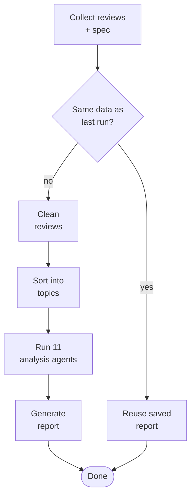
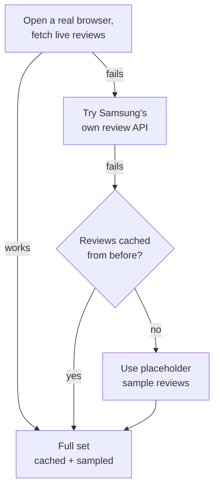
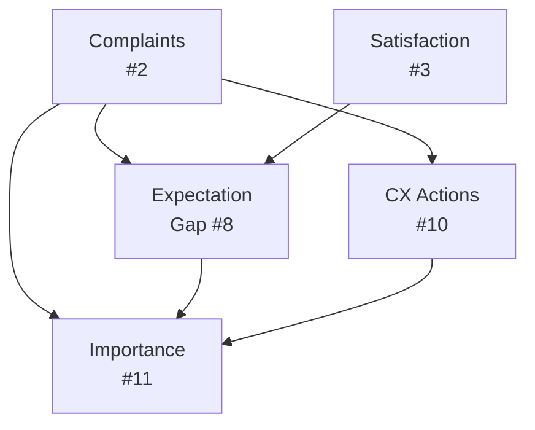
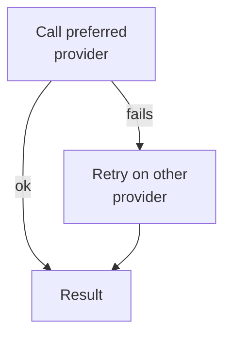

# Samsung TV VOC Intelligence Platform

AI-powered Voice of Customer (VOC) analysis for Samsung TVs. Scrapes reviews, cleans and classifies them, runs LLM analysis agents, and produces a Markdown/JSON report. Accessible via CLI, REST API, or a Next.js dashboard.

**Primary users:** in-house marketers (PDP copy, ad messaging), CX/support (FAQ updates, response scripts); designed to extend to product/PM and sales enablement.

Every analysis is grounded in both the review text **and** the product spec/PDP (price, account requirements, delivery status), so a genuine **product issue** can be separated from a **purchase-experience issue** (delivery, setup, installation).

## Architecture

What happens, step by step, when you run an analysis for a TV model:

1. **Collect the data:** Pull every customer review for that TV, plus its official product spec (price, features, delivery options). If the exact same data was already analyzed in a prior run, skip straight to step 5 and reuse that saved report instead of redoing all the AI analysis.
2. **Clean the reviews:** Remove duplicates and have AI lightly tidy up messy review text.
3. **Sort into topics:** AI groups every review into topics (picture quality, sound, smart TV features, delivery, etc.) so later steps can pull up "everything customers said about X."
4. **Run the analysis:** 11 specialized AI agents each study the reviews from a different angle:

   | # | Analysis | What it produces |
   |---|---|---|
   | 1 | Sentiment | Overall sentiment + breakdown by aspect (picture, sound, etc.) |
   | 2 | Complaints | Ranked complaint categories, split into product defects vs. purchase/delivery issues |
   | 3 | Satisfaction | What's driving positive reviews |
   | 4 | Improvement | What customers want changed |
   | 5 | Marketing | Messaging recommendations grounded in real customer language |
   | 6 | Competitive positioning | How this TV stacks up vs. TCL Q6, Hisense A7, LG UT70 |
   | 7 | Contradictions | Reviews where the star rating and the text disagree (e.g. a 1★ review that praises the product) |
   | 8 | Expectation gaps | Where reality fell short of what customers expected |
   | 9 | Segment differences | How different customer groups experience the product differently |
   | 10 | CX actions | Ready-to-use FAQ entries, support scripts, proactive notices |
   | 11 | Priority ranking | A frequency/impact matrix ranking every issue found above |

5. **Generate the report:** Combine every agent's findings into one executive-ready report (Markdown + JSON).



*(The "same data as last run?" check only runs if you pass `--skip-if-cached`; it compares a hash of the fetched reviews, model, sample size, and spec against the last saved run.)*

### How reviews get collected

Reviews live on a third-party review platform (BazaarVoice) embedded in Samsung's site, which blocks plain automated requests. So the platform opens a real, automated web browser to visit the product page and pull reviews the way a person's browser would, grabbing the *entire* review set (currently ~2,800 reviews) in one run, not just a sample.



If the live browser fetch fails, it falls back in order to: Samsung's own internal review API (best-effort, unconfirmed), then whatever was cached from a previous successful run, then, only if nothing else exists, made-up placeholder reviews, just so a demo never breaks with zero data.

Once collected, only a subset is actually sent to the AI for analysis (`--max-reviews`, default 200), to control cost and speed. That subset is picked so its mix of star ratings matches the full set (e.g. if 30% of all reviews are 5-star, ~30% of the analyzed subset is too), so the analysis isn't skewed by which reviews happened to load first.

**Product spec** combines two sources: the official spec sheet (display, audio, design, gaming, things that don't change) and a live page scrape (price, stock, delivery, things that do).

**Competitor specs** (TCL, Hisense, LG) are a fixed reference, only updated by hand via `voc refresh-competitors`. Competitor TV hardware doesn't change once it ships, so there's no need to refresh it automatically.

---

*The rest of this section is implementation detail for contributors. Skip to [Prerequisites](#prerequisites) if you just want to run it.*

### Components

| Path | What it does |
|---|---|
| `src/data/scraper.py` | Fetches reviews via a Playwright browser hitting BazaarVoice's gateway; falls back to Samsung's API, then cache/sample |
| `src/data/spec_extractor.py` | Merges the spec PDF (static fields) with a live scrape (commerce fields) into one `ProductSpec` |
| `src/data/competitor_spec_fetcher.py` | Manual competitor-spec refresh via a search-grounded OpenRouter call |
| `src/rag/` | Chunks reviews → embeds (OpenAI) → stores (Qdrant → Pinecone → in-memory) → retrieves per query |
| `src/agents/` | 11 analysis agents (table below); each retries on a second LLM provider if the first fails |
| `src/workflow/graph.py` | LangGraph state machine orchestrating the pipeline end to end |
| `src/reports/generator.py` | Renders the result to Markdown + JSON |
| `src/api/` | FastAPI app exposing the pipeline as a pollable background job |
| `src/cli.py` | Typer CLI that runs the pipeline synchronously |
| `frontend/` | Next.js dashboard that triggers runs and renders results |

### Analysis agents (`src/agents/`, execution order)

The 11 analyses above map 1:1 to agent classes (`SentimentAnalysisAgent`, `ComplaintAnalysisAgent`, ... `ImportanceAnalysisAgent`, in that numeric order). Each shares one accumulating `VOCAnalysisResult`; later agents can read earlier output. 4 of them do:



- **#7 Contradiction** scans the *full* population, not just the sample, catching rare cases like a 1★ review that praises the product
- **#11 Importance** runs last, deliberately, so it can reference complaints/gaps/CX actions from earlier agents

## Prerequisites

| Requirement | Why |
|---|---|
| Python ≥ 3.11 | Pipeline, CLI, API |
| Node.js | Frontend dashboard |
| Anthropic API key (or OpenRouter key) | LLM analysis agents |
| OpenAI API key | Embeddings, and as automatic fallback if Anthropic fails |
| Qdrant instance (optional) | Vector store; falls back to Pinecone if configured |

## Setup

```bash
pip install -e .
cp .env.example .env
```

Edit `.env` with at minimum:

```
ANTHROPIC_API_KEY=...      # or OPENROUTER_API_KEY
OPENAI_API_KEY=...         # required for embeddings
```

## Running the pipeline

### CLI

| Command | Description |
|---|---|
| `voc run UN50U7900FFXZA --max-reviews 200 --json` | Run the full pipeline, write reports to `data/reports/` |
| `voc run UN50U7900FFXZA --skip-if-cached` | Skip LLM analysis and reload the last result if nothing changed |
| `voc spec UN50U7900FFXZA` | Show the merged product spec and its `spec_source` |
| `voc refresh-competitors` | Manually refresh competitor specs via OpenRouter (requires `OPENROUTER_API_KEY`) |
| `voc sample UN50U7900FFXZA --n 5` | Preview sample reviews |

### API server

```bash
python main.py
# or: uvicorn main:app --reload
```

| Endpoint | Description |
|---|---|
| `POST /api/v1/analysis/run` | Start a pipeline job |
| `GET /api/v1/analysis/status/{job_id}` | Poll progress |
| `GET /api/v1/analysis/result/{job_id}` | Fetch the final result |
| `GET /api/v1/analysis/result/{job_id}/report` | Download the Markdown report |
| `GET /api/v1/reports/list` | List previously generated reports |
| `GET /api/v1/reports/{filename}` | Fetch a report by filename |
| `GET /api/v1/product/spec/{model_code}` | Live-scraped product spec |
| `GET /api/v1/product/competitors` | Competitor spec data |
| `GET /api/v1/reviews/sample/{model_code}` | Sample reviews |

Full interactive docs at `http://localhost:8000/docs`.

### Frontend

```bash
cd frontend
npm install
npm run dev
```

Expects the API server on `http://localhost:8000` (CORS pre-configured for `localhost:3000`).

## Configuration

Full reference in `.env.example`. Key settings:

| Variable | Purpose |
|---|---|
| `MODEL_HAIKU` / `MODEL_SONNET` / `MODEL_OPUS` | Anthropic model per agent tier |
| `OPENAI_MODEL_HAIKU` / `_SONNET` / `_OPUS` | OpenAI equivalents, used as automatic cross-provider fallback |
| `MAX_REVIEWS` | Default analysis sample size (population is always fetched in full) |
| `BATCH_SIZE` | Reviews per LLM call in cleaning/taxonomy, sized against a 4096-token ceiling |
| `ENABLE_RAG` | Toggle RAG retrieval |
| `QDRANT_URL` / `PINECONE_API_KEY` | Vector DB choice (Qdrant preferred, Pinecone fallback) |
| `OPENROUTER_API_KEY` | Required for `voc refresh-competitors`; also a fallback if `ANTHROPIC_API_KEY` is unset |
| `COMPETITOR_SEARCH_MODEL` | Model for `voc refresh-competitors`; default uses OpenRouter's `:online` web-search grounding |



A call "fails" on a rate limit, outage, or credit exhaustion. The retry uses the equivalent tier on the other provider (e.g. Sonnet retries as GPT-4o).
