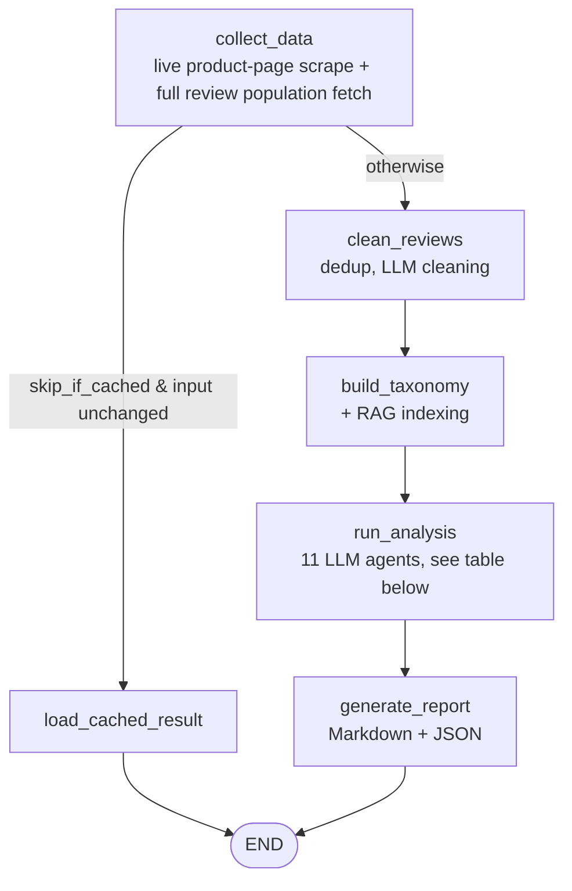

# Samsung TV VOC Intelligence Platform

AI-powered Voice of Customer (VOC) analysis for Samsung TVs. The pipeline scrapes customer reviews, cleans and classifies them, runs a battery of LLM-driven analysis agents, and produces an executive-ready Markdown/JSON report — accessible via CLI, REST API, or a Next.js dashboard.

Primary users are **in-house marketers** (PDP copy, ad messaging, promotions) and the **CX/customer support team** (FAQ updates, response scripts), with outputs designed to extend to product/PM, e-commerce ops, and sales enablement. Every analysis is grounded jointly in the review text **and** the product spec/PDP (price, account requirements, delivery/pickup status) so the platform can separate a genuine **product issue** from a **purchase-experience issue** (delivery, account setup, installation) instead of treating all complaints as defects.

## Architecture



| Path | Responsibility |
|---|---|
| `src/data/scraper.py` | Fetches reviews from BazaarVoice's current gateway via a Playwright-driven browser context (the classic passkey API is dead; the gateway blocks plain HTTP). Fetches and caches the **entire** real review population (e.g. ~2,700 reviews) every run, then draws an analysis sample stratified by rating (`--max-reviews`, default 200) so the analyzed subset's sentiment mix matches the true population. Falls back to a legacy API attempt, then cached/sample data, only if the live fetch fails. |
| `src/data/spec_extractor.py` | Live-scrapes the current Samsung product page, saves a raw snapshot under `data/raw/{model_code}/` (`page.html`, `page_meta.json`, `spec.json`, `reviews.json`), and parses price, the full spec table, account requirements, and delivery/pickup availability — so spec and reviews are always compared against one source of truth. Falls back to a cached snapshot, then a hardcoded dict, only if the live scrape fails. |
| `src/rag/` | Chunking, embedding, and retrieval (Qdrant preferred, Pinecone fallback), with a per-run retrieval cache to avoid duplicate embedding calls across agents |
| `src/agents/` | One agent per analysis task — see table below |
| `src/workflow/graph.py` | LangGraph state machine that orchestrates the nodes above end to end, including the opt-in dev replay cache (`skip_if_cached`) |
| `src/reports/generator.py` | Renders the final `VOCAnalysisResult` into Markdown/JSON |
| `src/api/` | FastAPI app exposing the pipeline as an async job (`main.py` is the entrypoint) |
| `src/cli.py` | Typer CLI for running the pipeline from the terminal |
| `frontend/` | Next.js dashboard that triggers a run and visualizes progress/results — cross-referenced sections (Paradox Reviews, Importance-Frequency Matrix, Expectation Gaps, CX Action Toolkit) link to each other's fix detail instead of repeating it |

### Analysis agents (`src/agents/`, execution order)

Each row runs inside the `run_analysis` node above, sharing one `VOCAnalysisResult` that accumulates as agents complete — later agents can read earlier agents' output.

| # | Agent | Key output | Notable behavior |
|---|---|---|---|
| 1 | `SentimentAnalysisAgent` | Sentiment distribution + per-aspect breakdown | |
| 2 | `ComplaintAnalysisAgent` | Ranked complaint categories | Tags each as `product_defect` vs `purchase_experience` |
| 3 | `SatisfactionAnalysisAgent` | Satisfaction drivers | |
| 4 | `ImprovementAnalysisAgent` | Improvement points | |
| 5 | `MarketingAnalysisAgent` | Messaging recommendations | |
| 6 | `CompetitivePositioningAgent` | Positioning vs. TCL Q6, Hisense A7, LG UT70 | Defend/Differentiate/Fix/Monitor executive quadrant |
| 7 | `ContradictionAnalysisAgent` | Paradox reviews (rating/text mismatches) | Scans the **entire fetched population**, not just the analyzed sample — genuine cases (e.g. a 1★ review that praises the product) are rare enough that a stratified sample can miss them entirely. Classifies each case into `mismatch_category` (`hidden_complaint`, `accidental_low_rating`, `service_failure_with_product_praise`, `non_product_issue`), routes it via `route_to` (`product_engineering` / `cx_fulfillment_warranty` / `marketing_cs_followup`), and flags `counts_as_product_issue` so service/delivery complaints don't distort product-defect metrics |
| 8 | `ExpectationGapAgent` | Expectation-vs-reality gaps | Runs on Claude Opus. Concise topic-only dimension names plus a non-redundant "why it matters" field |
| 9 | `SegmentDivergenceAnalysisAgent` | Segment-level insights | |
| 10 | `CXActionAgent` | FAQ entries, support scripts, proactive notices | Generated directly from complaint clusters |
| 11 | `ImportanceAnalysisAgent` | Frequency/impact matrix with a `recommended_action` and `priority_rank` per issue | Runs **last**, deliberately — cross-references complaints, expectation gaps, and CX actions generated above so each issue gets a synthesized next step and a holistic rank instead of just a quadrant label, and points to an existing CX action/expectation gap rather than restating it |

## Prerequisites

| Requirement | Why |
|---|---|
| Python ≥ 3.11 | Pipeline, CLI, API |
| Node.js | Frontend dashboard |
| Anthropic API key (or OpenRouter key) | LLM analysis agents |
| OpenAI API key | Embeddings (`text-embedding-3-large`), and as automatic fallback if Anthropic fails |
| Qdrant instance (optional) | Vector store — falls back to Pinecone if configured |

## Setup

```bash
# Install Python dependencies
pip install -e .

# Copy and fill in environment variables
cp .env.example .env
```

Edit `.env` with at minimum:

```
ANTHROPIC_API_KEY=...      # or OPENROUTER_API_KEY
OPENAI_API_KEY=...         # required for embeddings
```

## Running the pipeline

### CLI

| Command | Description |
|---|---|
| `voc run UN50U7900FFXZA --max-reviews 200 --json` | Run the full pipeline, write Markdown + JSON reports to `data/reports/` |
| `voc run UN50U7900FFXZA --skip-if-cached` | Skip all LLM analysis and reload the last saved result if reviews/spec are unchanged since the last full run |
| `voc spec UN50U7900FFXZA` | Show the live-scraped product spec |
| `voc sample UN50U7900FFXZA -n 5` | Preview sample reviews |

### API server

```bash
python main.py
# or: uvicorn main:app --reload
```

| Endpoint | Description |
|---|---|
| `POST /api/v1/analysis/run` | Start a pipeline job |
| `GET /api/v1/analysis/status/{job_id}` | Poll progress |
| `GET /api/v1/analysis/result/{job_id}` | Fetch the final result |
| `GET /api/v1/analysis/result/{job_id}/report` | Download the Markdown report |
| `GET /api/v1/reports/list` | List previously generated reports |
| `GET /api/v1/reports/{filename}` | Fetch a previously generated report by filename |
| `GET /api/v1/product/spec/{model_code}` | Live-scraped product spec |
| `GET /api/v1/product/competitors` | Competitor spec data |
| `GET /api/v1/reviews/sample/{model_code}` | Sample reviews |

Full interactive docs at `http://localhost:8000/docs`.

### Frontend

```bash
cd frontend
npm install
npm run dev
```

The dashboard expects the API server running on `http://localhost:8000` (CORS is pre-configured for `localhost:3000`).

## Configuration

Full reference in `.env.example`. Key settings:

| Variable | Purpose |
|---|---|
| `MODEL_HAIKU` / `MODEL_SONNET` / `MODEL_OPUS` | Anthropic model selection per agent tier |
| `OPENAI_MODEL_HAIKU` / `_SONNET` / `_OPUS` | OpenAI equivalents, used automatically as cross-provider fallback |
| `MAX_REVIEWS` | Default analysis sample size (population is always fetched in full regardless) |
| `BATCH_SIZE` | Reviews per LLM call in cleaning/taxonomy batching — sized against a `max_tokens=4096` ceiling; re-check that budget before raising |
| `ENABLE_RAG` | Toggle RAG retrieval |
| `QDRANT_URL` / `PINECONE_API_KEY` | Vector DB choice (Qdrant preferred, Pinecone fallback) |
