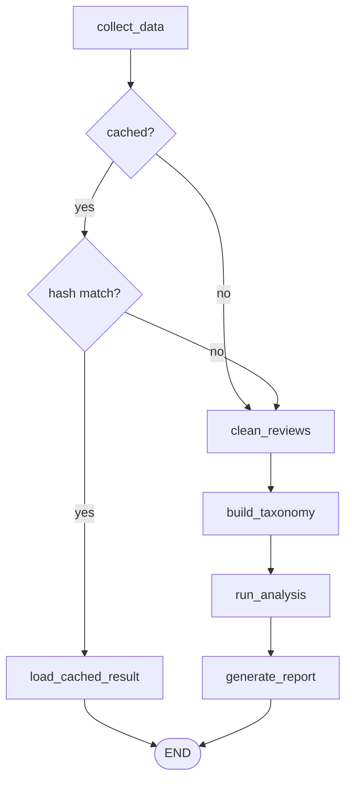
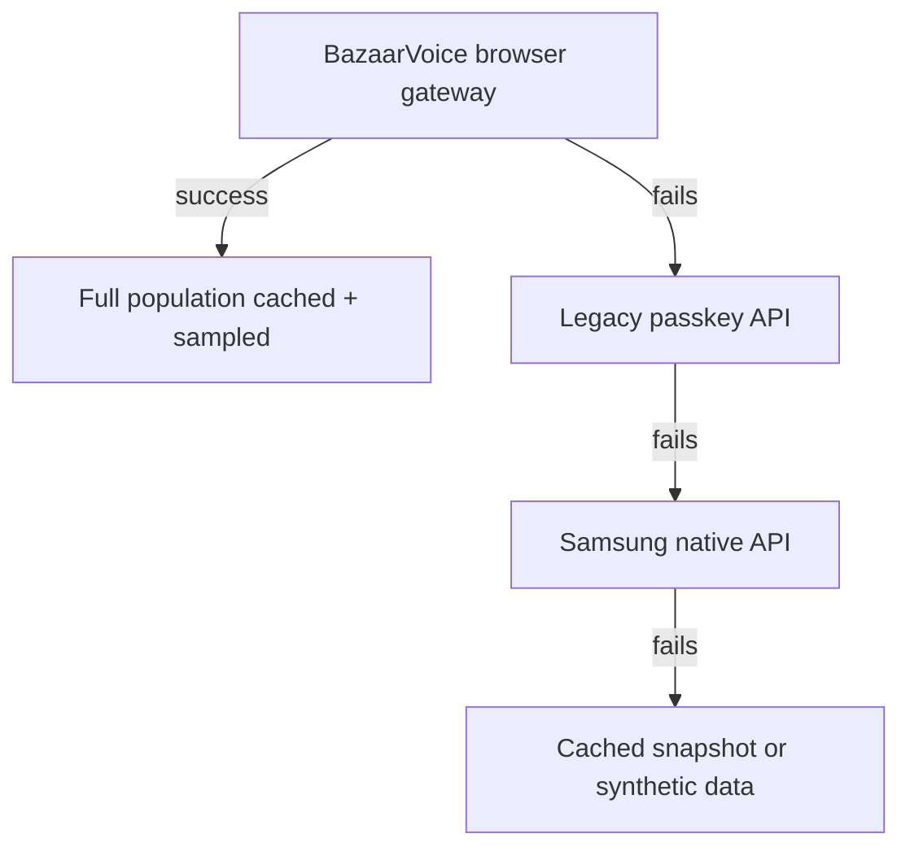
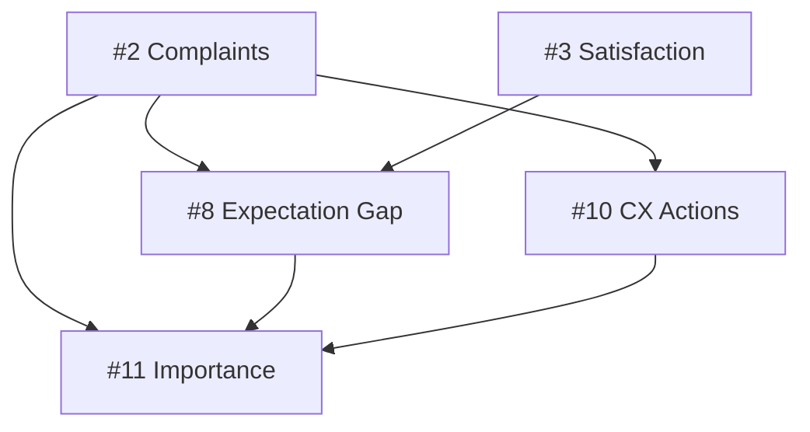
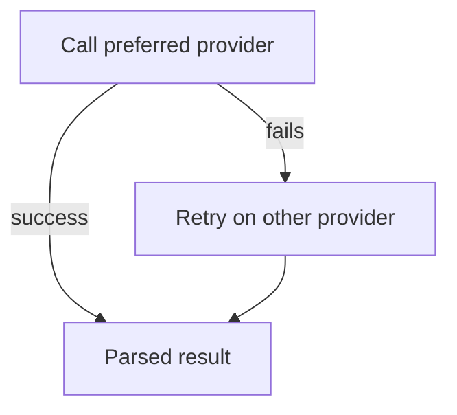

# Samsung TV VOC Intelligence Platform

AI-powered Voice of Customer (VOC) analysis for Samsung TVs. The pipeline scrapes customer reviews, cleans and classifies them, runs a battery of LLM-driven analysis agents, and produces an executive-ready Markdown/JSON report. Accessible via CLI, REST API, or a Next.js dashboard.

Primary users:

- **In-house marketers**: PDP copy, ad messaging, promotions
- **CX/customer support team**: FAQ updates, response scripts
- Designed to extend to product/PM, e-commerce ops, and sales enablement

Every analysis is grounded jointly in the review text **and** the product spec/PDP (price, account requirements, delivery/pickup status), so the platform can separate a genuine **product issue** from a **purchase-experience issue** (delivery, account setup, installation) instead of treating all complaints as defects.

## Architecture



- **`collect_data`**: live product-page scrape plus a full review-population fetch (see the fallback chain below)
- **`cached?`**: only checked at all if `--skip-if-cached` was passed; otherwise always goes straight to `clean_reviews`
- **`hash match?`**: compares a hash of the fetched reviews, model code, max_reviews, and live spec against the saved manifest. Any change forces a full run
- **`load_cached_result`**: reloads the last saved `VOCAnalysisResult` from disk, skipping every LLM agent
- **`clean_reviews`**: dedup + LLM cleaning
- **`build_taxonomy`**: taxonomy classification + RAG indexing
- **`run_analysis`**: the 11 analysis agents, see table and dependency diagram below
- **`generate_report`**: renders Markdown + JSON, then writes the manifest for the next run's cache check

### Data collection fallback chain



"Full population cached + sampled" means the entire fetched set (e.g. ~2,700 reviews) is cached to disk, then a stratified-by-rating sample is drawn for analysis (`--max-reviews`, default 200).

The product spec follows a shorter chain: live page scrape, falling back to the last cached `spec.json`, falling back to a hardcoded dict, only if each prior step fails.

### Components

| Path | Responsibility |
|---|---|
| `src/data/scraper.py` | Fetches reviews from BazaarVoice's current gateway via a Playwright-driven browser context |
| `src/data/spec_extractor.py` | Live-scrapes the current Samsung product page and parses spec, account requirements, and delivery/pickup availability |
| `src/rag/` | Chunking, embedding, and retrieval (Qdrant preferred, Pinecone fallback) |
| `src/agents/` | One agent per analysis task, see table below |
| `src/workflow/graph.py` | LangGraph state machine that orchestrates the nodes above end to end |
| `src/reports/generator.py` | Renders the final `VOCAnalysisResult` into Markdown/JSON |
| `src/api/` | FastAPI app exposing the pipeline as an async job (`main.py` is the entrypoint) |
| `src/cli.py` | Typer CLI for running the pipeline from the terminal |
| `frontend/` | Next.js dashboard that triggers a run and visualizes progress/results |

Notes on the components above:

- **Scraper**: the classic passkey-based BazaarVoice API is dead, and the current gateway blocks plain HTTP, hence the Playwright browser context. Every run fetches and caches the entire real review population (e.g. ~2,700 reviews), then draws an analysis sample stratified by rating (`--max-reviews`, default 200) so the analyzed subset's sentiment mix matches the true population. Falls back to a legacy API attempt, then cached/sample data, only if the live fetch fails.
- **Spec extractor**: saves a raw snapshot under `data/raw/{model_code}/` (`page.html`, `page_meta.json`, `spec.json`, `reviews.json`) on every run, so spec and reviews are always compared against one source of truth. Falls back to a cached snapshot, then a hardcoded dict, only if the live scrape fails.
- **RAG**: includes a per-run retrieval cache to avoid duplicate embedding calls across agents.
- **Workflow graph**: also implements the opt-in dev replay cache (`skip_if_cached`).
- **Frontend**: cross-referenced sections (Paradox Reviews, Importance-Frequency Matrix, Expectation Gaps, CX Action Toolkit) link to each other's fix detail instead of repeating it.

### Analysis agents (`src/agents/`, execution order)

Each row runs inside the `run_analysis` node above, sharing one `VOCAnalysisResult` that accumulates as agents complete. Later agents can read earlier agents' output.

| # | Agent | Key output |
|---|---|---|
| 1 | `SentimentAnalysisAgent` | Sentiment distribution + per-aspect breakdown |
| 2 | `ComplaintAnalysisAgent` | Ranked complaint categories, tagged `product_defect` vs `purchase_experience` |
| 3 | `SatisfactionAnalysisAgent` | Satisfaction drivers |
| 4 | `ImprovementAnalysisAgent` | Improvement points |
| 5 | `MarketingAnalysisAgent` | Messaging recommendations |
| 6 | `CompetitivePositioningAgent` | Positioning vs. TCL Q6, Hisense A7, LG UT70, with a Defend/Differentiate/Fix/Monitor executive quadrant |
| 7 | `ContradictionAnalysisAgent` | Paradox reviews, rating/text mismatches (see below) |
| 8 | `ExpectationGapAgent` | Expectation-vs-reality gaps (see below) |
| 9 | `SegmentDivergenceAnalysisAgent` | Segment-level insights |
| 10 | `CXActionAgent` | FAQ entries, support scripts, and proactive notices, generated directly from complaint clusters |
| 11 | `ImportanceAnalysisAgent` | Frequency/impact matrix with a `recommended_action` and `priority_rank` per issue (see below) |

Most agents only read `reviews`/`retriever`. Four read another agent's output directly:



Three agents worth calling out:

- **`ContradictionAnalysisAgent` (#7)** scans the entire fetched population, not just the analyzed sample. Genuine cases (e.g. a 1★ review that praises the product) are rare enough that a stratified sample can miss them entirely. Each case gets:
  - a `mismatch_category`: `hidden_complaint`, `accidental_low_rating`, `service_failure_with_product_praise`, or `non_product_issue`
  - a `route_to`: `product_engineering`, `cx_fulfillment_warranty`, or `marketing_cs_followup`
  - a `counts_as_product_issue` flag, so service/delivery complaints don't distort product-defect metrics
- **`ExpectationGapAgent` (#8)** runs on Claude Opus. Dimension names are concise and topic-only, plus a non-redundant "why it matters" field.
- **`ImportanceAnalysisAgent` (#11)** runs last, deliberately. It cross-references complaints, expectation gaps, and CX actions generated earlier in the run, so each issue gets a synthesized next step and a holistic rank instead of just a quadrant label, and points to an existing CX action/expectation gap rather than restating it.

## Prerequisites

| Requirement | Why |
|---|---|
| Python ≥ 3.11 | Pipeline, CLI, API |
| Node.js | Frontend dashboard |
| Anthropic API key (or OpenRouter key) | LLM analysis agents |
| OpenAI API key | Embeddings (`text-embedding-3-large`), and as automatic fallback if Anthropic fails |
| Qdrant instance (optional) | Vector store; falls back to Pinecone if configured |

## Setup

```bash
# Install Python dependencies
pip install -e .

# Copy and fill in environment variables
cp .env.example .env
```

Edit `.env` with at minimum:

```
ANTHROPIC_API_KEY=...      # or OPENROUTER_API_KEY
OPENAI_API_KEY=...         # required for embeddings
```

## Running the pipeline

### CLI

| Command | Description |
|---|---|
| `voc run UN50U7900FFXZA --max-reviews 200 --json` | Run the full pipeline, write Markdown + JSON reports to `data/reports/` |
| `voc run UN50U7900FFXZA --skip-if-cached` | Skip all LLM analysis and reload the last saved result if reviews/spec are unchanged since the last full run |
| `voc spec UN50U7900FFXZA` | Show the live-scraped product spec |
| `voc sample UN50U7900FFXZA -n 5` | Preview sample reviews |

### API server

```bash
python main.py
# or: uvicorn main:app --reload
```

| Endpoint | Description |
|---|---|
| `POST /api/v1/analysis/run` | Start a pipeline job |
| `GET /api/v1/analysis/status/{job_id}` | Poll progress |
| `GET /api/v1/analysis/result/{job_id}` | Fetch the final result |
| `GET /api/v1/analysis/result/{job_id}/report` | Download the Markdown report |
| `GET /api/v1/reports/list` | List previously generated reports |
| `GET /api/v1/reports/{filename}` | Fetch a previously generated report by filename |
| `GET /api/v1/product/spec/{model_code}` | Live-scraped product spec |
| `GET /api/v1/product/competitors` | Competitor spec data |
| `GET /api/v1/reviews/sample/{model_code}` | Sample reviews |

Full interactive docs at `http://localhost:8000/docs`.

### Frontend

```bash
cd frontend
npm install
npm run dev
```

The dashboard expects the API server running on `http://localhost:8000` (CORS is pre-configured for `localhost:3000`).

## Configuration

Full reference in `.env.example`. Key settings:

| Variable | Purpose |
|---|---|
| `MODEL_HAIKU` / `MODEL_SONNET` / `MODEL_OPUS` | Anthropic model selection per agent tier |
| `OPENAI_MODEL_HAIKU` / `_SONNET` / `_OPUS` | OpenAI equivalents, used automatically as cross-provider fallback |
| `MAX_REVIEWS` | Default analysis sample size (population is always fetched in full regardless) |
| `BATCH_SIZE` | Reviews per LLM call in cleaning/taxonomy batching, sized against a `max_tokens=4096` ceiling; re-check that budget before raising |
| `ENABLE_RAG` | Toggle RAG retrieval |
| `QDRANT_URL` / `PINECONE_API_KEY` | Vector DB choice (Qdrant preferred, Pinecone fallback) |

Every agent call follows the same fallback, in either direction depending on which provider it prefers:



A call "fails" on a rate limit, an outage, or credit exhaustion. The retry uses the equivalent model tier on the other provider (e.g. Sonnet retries as GPT-4o).
