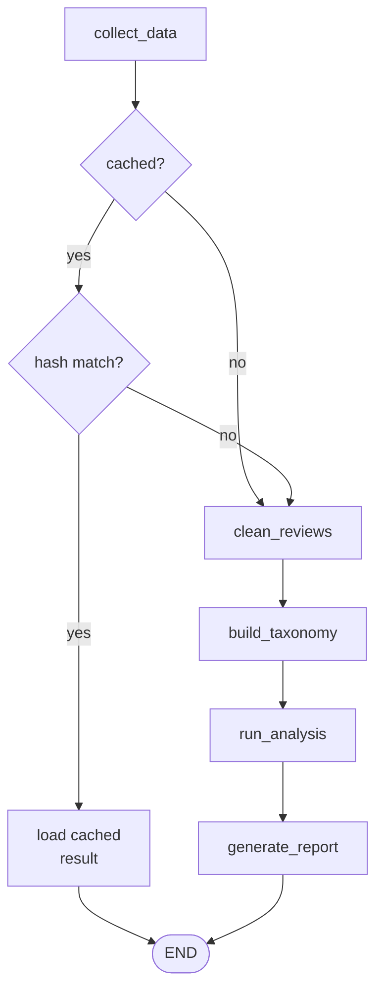
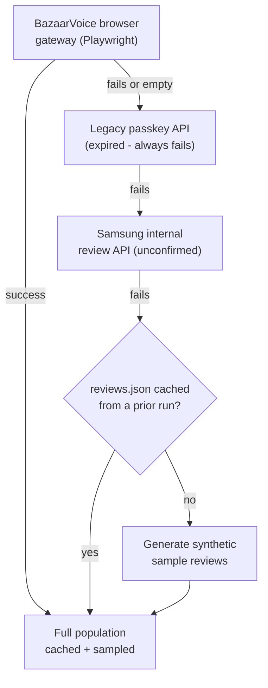
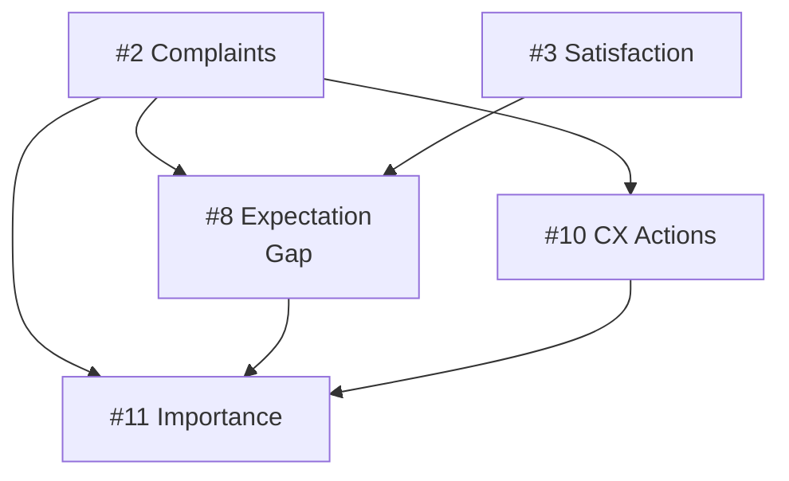
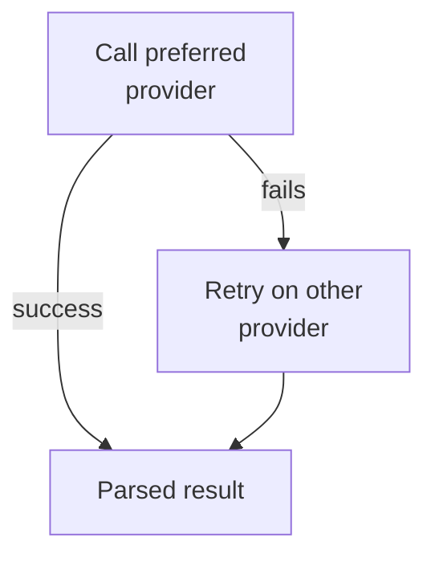

# Samsung TV VOC Intelligence Platform

AI-powered Voice of Customer (VOC) analysis for Samsung TVs. The pipeline scrapes customer reviews, cleans and classifies them, runs a battery of LLM-driven analysis agents, and produces an executive-ready Markdown/JSON report. Accessible via CLI, REST API, or a Next.js dashboard.

Primary users:

- **In-house marketers**: PDP copy, ad messaging, promotions
- **CX/customer support team**: FAQ updates, response scripts
- Designed to extend to product/PM, e-commerce ops, and sales enablement

Every analysis is grounded jointly in the review text **and** the product spec/PDP (price, account requirements, delivery/pickup status), so the platform can separate a genuine **product issue** from a **purchase-experience issue** (delivery, account setup, installation) instead of treating all complaints as defects.

## Architecture



- **`collect_data`**: live product-page scrape plus a full review-population fetch (see the fallback chain below)
- **`cached?`**: only checked at all if `--skip-if-cached` was passed; otherwise always goes straight to `clean_reviews`
- **`hash match?`**: compares a hash of the fetched reviews, model code, max_reviews, and live spec against the saved manifest. Any change forces a full run
- **`load_cached_result`**: reloads the last saved `VOCAnalysisResult` from disk, skipping every LLM agent
- **`clean_reviews`**: dedup + LLM cleaning
- **`build_taxonomy`**: taxonomy classification + RAG indexing
- **`run_analysis`**: the 11 analysis agents, see table and dependency diagram below
- **`generate_report`**: renders Markdown + JSON, then writes the manifest for the next run's cache check

### Data collection fallback chain



Only stage 1 is known to work today. Stage 2 (`fetch_reviews_bv`, the classic passkey-based `api.bazaarvoice.com` endpoint) is retained in code as a defensive fallback, but `SAMSUNG_BV_PASSKEY` is expired — BazaarVoice rejects it on every call, so this stage fails unconditionally and has never produced real data. Stage 3 (`fetch_reviews_samsung_api`, Samsung's own internal review endpoint) is a best-effort attempt against an undocumented API and is similarly unverified; it's cheap to try once 1 and 2 have failed, but isn't a confirmed working path.

If stage 1 succeeds, the entire fetched population (e.g. ~2,700 reviews) is what gets cached and sampled. But regardless of *which* stage produces the final review list — including the stage-4/5 fallback — `collect_data` (`src/workflow/graph.py`) calls `scraper.save_raw()` unconditionally on whatever list it got back, overwriting `data/raw/{model_code}/reviews.json`. That means if every live source fails on a run where no prior cache existed, the synthetic sample data generated in stage 5 gets written to that same cache file — so a later run that also fails live will load that synthetic data back in stage 4 rather than regenerating it. Either way, a stratified-by-rating sample is then drawn from whatever was collected for the LLM analysis stage (`--max-reviews`, default 200).

The product spec is a merge, not a fallback chain: the assignment-provided spec PDF (`data/raw/{model_code}/spec.pdf`) is authoritative for static fields (display, audio, design, gaming, etc), since it doesn't change and is the literal source the assignment names. A live page scrape always also runs, contributing only the commerce-dynamic fields the PDF doesn't have (price, stock, delivery/pickup, account requirement). `spec_source` reflects what actually contributed: `pdf+live_scrape`, `pdf+cache` (scrape failed, used the last cached snapshot instead), or `pdf_only` (both failed). If the PDF file itself is missing, falls back to today's scrape-only behavior: live scrape → cached `spec.json` → hardcoded dict.

Competitor TV specs (`COMPETITOR_SPECS`, used by the competitive-positioning task) follow a separate, much simpler path: a hardcoded dict, optionally overridden per-competitor by a manually-triggered live fetch (`voc refresh-competitors`, see below) cached to `data/raw/competitors/{name}/spec.json`. This is never run automatically — hardware specs for an already-released TV don't change, so refetching on every pipeline run would only add cost, latency, and non-determinism for static data.

### Components

| Path | Responsibility | Mechanism / interacts with |
|---|---|---|
| `src/data/scraper.py` | Fetches the full review population for a product model | Launches headless Chromium via Playwright, loads the real Samsung product page so cookies/session are set, then calls BazaarVoice's `apps.bazaarvoice.com/bfd` gateway from inside that browser context (plain `httpx` requests get a 401). Falls back through the chain above; called from `collect_data` in `src/workflow/graph.py` |
| `src/data/spec_extractor.py` | Builds the merged `ProductSpec` (static spec + commerce data) consumed by every analysis agent | Parses the assignment-provided spec PDF with PyMuPDF (`fitz`) for static fields (display/audio/design/gaming); separately calls Samsung's `gapi/v1/bridge/cacheable/bridge-data` endpoint over plain `httpx` (no browser needed here) for commerce fields (price, stock, delivery, account requirement); merges the two, caching the live half to `data/raw/{model_code}/spec.json` |
| `src/data/competitor_spec_fetcher.py` | Manual, out-of-band refresh of competitor TV specs (`voc refresh-competitors`) | Calls OpenRouter's chat-completions API directly via the `openai` SDK pointed at `https://openrouter.ai/api/v1`, using a `:online`-suffixed model for web-search grounding. Deliberately not a `BaseAgent` subclass, so it can't affect the retry/fallback logic shared by the 11 production agents. Writes to `data/raw/competitors/{name}/spec.json`, read back by `spec_extractor.py` |
| `src/rag/` | Chunks reviews, embeds them, and retrieves the most relevant ones per analysis query | `chunker.py` turns each review into one chunk with metadata (rating, date, verified purchase); `embedder.py` calls OpenAI's `text-embedding-3-large`; `vector_store.py` tries Qdrant, then Pinecone, then falls back to an in-process Python list shared across the run if neither is configured/reachable; `retriever.py` wraps the store with a per-run query cache and is what agents call through `src/workflow/graph.py` |
| `src/agents/` | One agent class per analysis task (table below) | Each extends `BaseAgent` (`src/agents/base.py`): calls its preferred provider (Anthropic by default) with `tenacity`-driven retries (3 attempts, exponential backoff), then automatically retries on the other provider's equivalent model tier (e.g. Sonnet → GPT-4o) if every attempt on the primary fails |
| `src/workflow/graph.py` | Orchestrates `collect_data → clean_reviews → build_taxonomy → run_analysis → generate_report`, sharing one accumulating `VOCAnalysisResult` across nodes | A LangGraph `StateGraph`; also implements the opt-in dev replay cache (`skip_if_cached`) and pushes live per-node progress into the shared in-memory job store (`src/api/state.py`) so the API/frontend can poll it mid-run |
| `src/reports/generator.py` | Renders the final `VOCAnalysisResult` | A Jinja2 template renders Markdown; a parallel JSON dump is also written. Both land in `data/reports/` |
| `src/api/` | Exposes the pipeline as a pollable async job | FastAPI (`routes.py`) launches the LangGraph run via `BackgroundTasks` so the HTTP request returns immediately; `state.py` holds the thread-local, in-memory job store that both the background task and the polling endpoints read/write; `main.py` is the ASGI entrypoint (run with `uvicorn`) |
| `src/cli.py` | Runs the pipeline synchronously from the terminal | Typer app that calls `run_voc_pipeline()` directly in-process (no job queue/background task) and prints Rich-formatted progress as each node completes |
| `frontend/` | Triggers a run and visualizes progress/results | Next.js app that calls the FastAPI endpoints above, polls job status while a run is in progress, then renders the report, with cross-referenced sections (Paradox Reviews, Importance-Frequency Matrix, Expectation Gaps, CX Action Toolkit) linking to each other's fix detail instead of repeating it |

Two cross-cutting notes not obvious from the table:

- **Raw snapshot directory**: every `collect_data` run writes its evidence to `data/raw/{model_code}/` (`page.html`, `page_meta.json`, `spec.json`, `reviews.json`, `spec.pdf`) regardless of which fallback stage produced it, so spec and reviews are always compared against the same on-disk source of truth for that run.
- **Provider fallback is bidirectional**: the same retry-then-switch-provider logic in `src/agents/base.py` applies whichever provider is configured as primary, not just Anthropic → OpenAI (see the "every agent call" diagram further down).

### Analysis agents (`src/agents/`, execution order)

Each row runs inside the `run_analysis` node above, sharing one `VOCAnalysisResult` that accumulates as agents complete. Later agents can read earlier agents' output.

| # | Agent | Key output |
|---|---|---|
| 1 | `SentimentAnalysisAgent` | Sentiment distribution + per-aspect breakdown |
| 2 | `ComplaintAnalysisAgent` | Ranked complaint categories, tagged `product_defect` vs `purchase_experience` |
| 3 | `SatisfactionAnalysisAgent` | Satisfaction drivers |
| 4 | `ImprovementAnalysisAgent` | Improvement points |
| 5 | `MarketingAnalysisAgent` | Messaging recommendations |
| 6 | `CompetitivePositioningAgent` | Positioning vs. TCL Q6, Hisense A7, LG UT70, with a Defend/Differentiate/Fix/Monitor executive quadrant |
| 7 | `ContradictionAnalysisAgent` | Paradox reviews, rating/text mismatches (see below) |
| 8 | `ExpectationGapAgent` | Expectation-vs-reality gaps (see below) |
| 9 | `SegmentDivergenceAnalysisAgent` | Segment-level insights |
| 10 | `CXActionAgent` | FAQ entries, support scripts, and proactive notices, generated directly from complaint clusters |
| 11 | `ImportanceAnalysisAgent` | Frequency/impact matrix with a `recommended_action` and `priority_rank` per issue (see below) |

Most agents only read `reviews`/`retriever`. Four read another agent's output directly:



Three agents worth calling out:

- **`ContradictionAnalysisAgent` (#7)** scans the entire fetched population, not just the analyzed sample. Genuine cases (e.g. a 1★ review that praises the product) are rare enough that a stratified sample can miss them entirely. Each case gets:
  - a `mismatch_category`: `hidden_complaint`, `accidental_low_rating`, `service_failure_with_product_praise`, or `non_product_issue`
  - a `route_to`: `product_engineering`, `cx_fulfillment_warranty`, or `marketing_cs_followup`
  - a `counts_as_product_issue` flag, so service/delivery complaints don't distort product-defect metrics
- **`ExpectationGapAgent` (#8)** runs on Claude Opus. Dimension names are concise and topic-only, plus a non-redundant "why it matters" field.
- **`ImportanceAnalysisAgent` (#11)** runs last, deliberately. It cross-references complaints, expectation gaps, and CX actions generated earlier in the run, so each issue gets a synthesized next step and a holistic rank instead of just a quadrant label, and points to an existing CX action/expectation gap rather than restating it.

## Prerequisites

| Requirement | Why |
|---|---|
| Python ≥ 3.11 | Pipeline, CLI, API |
| Node.js | Frontend dashboard |
| Anthropic API key (or OpenRouter key) | LLM analysis agents |
| OpenAI API key | Embeddings (`text-embedding-3-large`), and as automatic fallback if Anthropic fails |
| Qdrant instance (optional) | Vector store; falls back to Pinecone if configured |

## Setup

```bash
# Install Python dependencies
pip install -e .

# Copy and fill in environment variables
cp .env.example .env
```

Edit `.env` with at minimum:

```
ANTHROPIC_API_KEY=...      # or OPENROUTER_API_KEY
OPENAI_API_KEY=...         # required for embeddings
```

## Running the pipeline

### CLI

| Command | Description |
|---|---|
| `voc run UN50U7900FFXZA --max-reviews 200 --json` | Run the full pipeline, write Markdown + JSON reports to `data/reports/` |
| `voc run UN50U7900FFXZA --skip-if-cached` | Skip all LLM analysis and reload the last saved result if reviews/spec are unchanged since the last full run |
| `voc spec UN50U7900FFXZA` | Show the merged product spec (PDF + live scrape) and its `spec_source` |
| `voc refresh-competitors` | Manually refresh competitor TV specs via a search-grounded OpenRouter call; review the printed sources before trusting it (requires `OPENROUTER_API_KEY`) |
| `voc sample UN50U7900FFXZA -n 5` | Preview sample reviews |

### API server

```bash
python main.py
# or: uvicorn main:app --reload
```

| Endpoint | Description |
|---|---|
| `POST /api/v1/analysis/run` | Start a pipeline job |
| `GET /api/v1/analysis/status/{job_id}` | Poll progress |
| `GET /api/v1/analysis/result/{job_id}` | Fetch the final result |
| `GET /api/v1/analysis/result/{job_id}/report` | Download the Markdown report |
| `GET /api/v1/reports/list` | List previously generated reports |
| `GET /api/v1/reports/{filename}` | Fetch a previously generated report by filename |
| `GET /api/v1/product/spec/{model_code}` | Live-scraped product spec |
| `GET /api/v1/product/competitors` | Competitor spec data |
| `GET /api/v1/reviews/sample/{model_code}` | Sample reviews |

Full interactive docs at `http://localhost:8000/docs`.

### Frontend

```bash
cd frontend
npm install
npm run dev
```

The dashboard expects the API server running on `http://localhost:8000` (CORS is pre-configured for `localhost:3000`).

## Configuration

Full reference in `.env.example`. Key settings:

| Variable | Purpose |
|---|---|
| `MODEL_HAIKU` / `MODEL_SONNET` / `MODEL_OPUS` | Anthropic model selection per agent tier |
| `OPENAI_MODEL_HAIKU` / `_SONNET` / `_OPUS` | OpenAI equivalents, used automatically as cross-provider fallback |
| `MAX_REVIEWS` | Default analysis sample size (population is always fetched in full regardless) |
| `BATCH_SIZE` | Reviews per LLM call in cleaning/taxonomy batching, sized against a `max_tokens=4096` ceiling; re-check that budget before raising |
| `ENABLE_RAG` | Toggle RAG retrieval |
| `QDRANT_URL` / `PINECONE_API_KEY` | Vector DB choice (Qdrant preferred, Pinecone fallback) |
| `OPENROUTER_API_KEY` | Required only for `voc refresh-competitors`; also usable as an Anthropic-compatible fallback if `ANTHROPIC_API_KEY` is unset |
| `COMPETITOR_SEARCH_MODEL` | Model used by `voc refresh-competitors`, default `anthropic/claude-sonnet-4-6:online` (the `:online` suffix enables OpenRouter's web-search grounding on any model, billed at a premium) |

Every agent call follows the same fallback, in either direction depending on which provider it prefers:



A call "fails" on a rate limit, an outage, or credit exhaustion. The retry uses the equivalent model tier on the other provider (e.g. Sonnet retries as GPT-4o).
